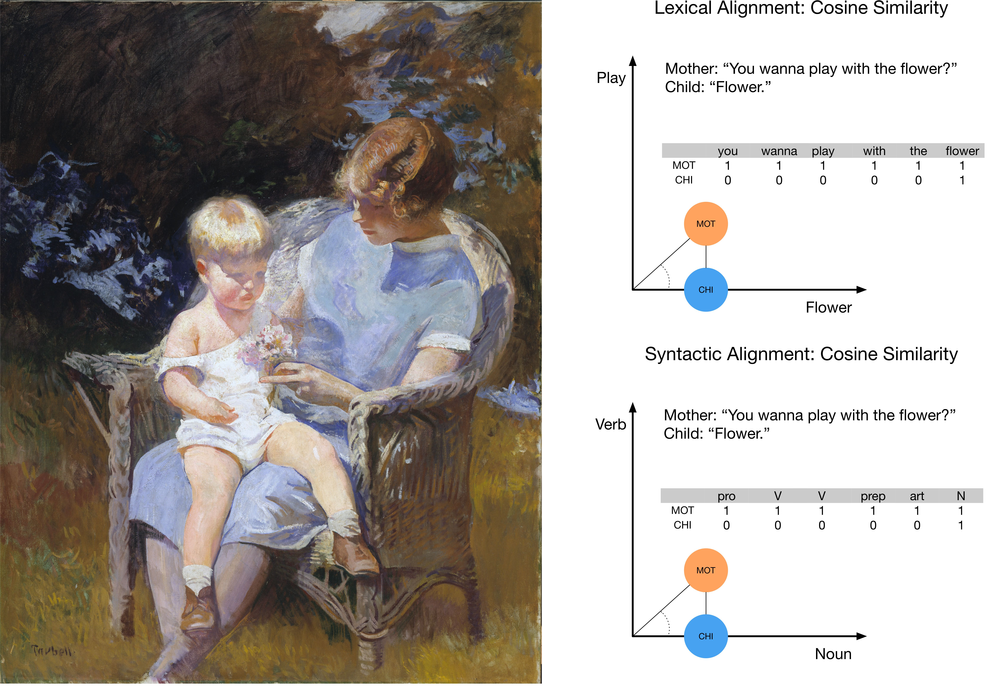

```{r setup, include=FALSE}
knitr::opts_chunk$set(echo = FALSE)
```

```{r libraries}
pacman::p_load("dplyr", "kableExtra", "tidyverse", "ggpubr")
```


```{r prep, echo=FALSE, warning = FALSE}

# for rendering pdf
#pagedown::chrome_print("/Users/ethan/Documents/GitHub/MOLA2020/Poster/Fusaroli-et-al.Rmd")

# read in data

t1 <- read.csv("/Users/ethan/Documents/GitHub/MOLA2020/Poster/Table1b.csv")
t2 <- read.csv("/Users/ethan/Documents/GitHub/MOLA2020/Poster/Table2b.csv")
t3 <- read.csv("/Users/ethan/Documents/GitHub/MOLA2020/Poster/Table3b.csv")

# function for making bar-plots out of table data

bp <- function(t){
  barcolor1 <- "#8FA2DF"
  barcolor2 <- "#D8B743"
  t$Predictors <- factor(t$Predictors, levels = t$Predictors)
  t$Predictors <- fct_rev(t$Predictors)
  t_est <- t[,c(1,2,5)]
  t_lower <- t[, c(1,3,6)]
  t_upper <- t[, c(1,4,7)]
  t_est <- gather(t_est, key = "Type", value = "LogOdds", -Predictors)
  t_lower <- gather(t_lower, key = "ci_Lower", value = "Lower", -Predictors)
  t_upper <- gather(t_upper, key = "ci_Upper", value = "Upper", -Predictors)
  t_est$Lower <- t_lower$Lower
  t_est$Upper <- t_upper$Upper
  ggplot(t_est, aes(Predictors, LogOdds, fill = Type)) +
    geom_col(aes(), position = "dodge") +
    geom_errorbar(aes(ymin = Lower, ymax = Upper), width = .2, position=position_dodge(.9)) +
    coord_flip() +
    #ylim(-0.75, 0.75) +
    scale_fill_manual("Alignment Type", values = c("Lexical" = barcolor1, "Syntactic" = barcolor2)) +
    theme_classic() +
    labs( y = "\U03B2 (Log Odds)",
          x = "")
}

# read in transcript data

transcript_lex <- read.csv("/Users/ethan/Documents/GitHub/MOLA2020/Poster/transcript-example-lexical.csv")
transcript_syn <- read.csv("/Users/ethan/Documents/GitHub/MOLA2020/Poster/transcript-example-syntactic.csv")

# prepare transcripts and drow tables

pt <- function(transcript){
  transcript$X <- NULL
  names(transcript)[names(transcript) == 'Cosine.similarity'] <- 'Cosine Similarity'
  kable(transcript, "html", caption = "Lexical Alignment", align = "l", booktabs = T)
}

```


# What is Conversational Alignment, and How Can We Measure It?

```{r echo=FALSE, fig.cap = "Edmund C. Tarbell, \"Marjorie and Little Edmund\" and Cosine Similarity",  out.width= "80%", fig.align="center"}

```

Conversational Alignment is the re-use of an interlocutor’s words and syntax, and helps establish common ground [@clark1991grounding]. We calculated children's alignment in turn-by-turn utterances in the conversations of 67 parent-child dyads over 2 years (approx. ages 2-4).

# What Predicts Whether Children Align With Parents' Utterances?  

```{r fig1, fig.cap = "Factors influencing liklihood of child aligning any tokens",message=FALSE, warning = F, out.width='75%'}

bp(t1)

```

Older children aligned more often, although less so in children with ASD. VS and MEL scores were the best predictors of children producing an utterance with aligned tokens.

# What Does Alignment Actually Look Like?

<br>

```{r echo=FALSE, out.width= "70%", fig.align="center"}

pt(transcript_lex)

```

<br>

```{r echo=FALSE, out.width= "70%", fig.align="center"}

pt(transcript_syn)

```

<br>

# What Predicts Exact Repetition of Parents' Utterances?

```{r fig2, fig.cap = "Factors influencing liklihood of child aligning all tokens", message=FALSE, warning = F, out.width='75%'}

bp(t3)

```
Older children were less likely to produce an exact repetition of their parent's utterance, although this was less so in children with ASD. High scores on VS predicted exact repetition positively, while high scores on MEL predicted exact repetition negatively.

<br>

# What Predicts the Level of Partial Alignment?

```{r fig3, fig.cap = "Factors influencing amount partial alignment", message=FALSE, warning = F, out.width='75%'}

bp(t2)

```
Older children aligned less, and chldren with ASD produced fewer aligned lexical tokens than TD children.

# Conclusion and Next Steps
Children with ASD do align lexically and syntactically, but show a slightly different pattern than TD children. An important next step will be to take a closer qualitative look at the exchanges between parents and children, to see *what sort* of tokens they align, and under *what circumstances,* as well as assessing children's alignment as a predictor of later language outcomes.

# Technical details
Cosine similiarity (CS) was calculated using the ALIGN Python library [@duran2019align] for lexical (1-gram) and syntactic (2-gram) tokens. We used a Bayesian multilevel zero-and-one-inflated beta regression approach, modelling alignment as a distribution with three parameters, accounting for the propensity of children to align at all (CS = 0), exact repetitions (CS = 1), and the number of linguistic forms aligned in partial alignment (CS > 0 < 1), as a function of diagnostic group, age (visit), Vineland Socialization, Mullen Expressive Language and Mullen Visual Reception. Poster built with Posterdown  [@R-posterdown] for R.


```{r, include=FALSE}
knitr::write_bib(c('knitr','rmarkdown','posterdown','pagedown'), 'packages.bib')
```

# References
