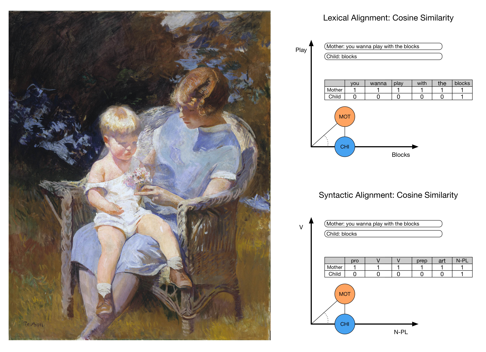

```{r setup, include=FALSE}
knitr::opts_chunk$set(echo = FALSE)
```

```{r libraries}
pacman::p_load("dplyr", "kableExtra", "tidyverse")
```


```{r colorbar, echo=FALSE}
# for rendering pdf
#pagedown::chrome_print("/Users/ethan/Documents/GitHub/MOLA2020/Poster/standard/Fusaroli-et-al.Rmd")

# colorbar function copied from: https://stackoverflow.com/questions/49916591/how-to-reverse-only-one-bar-in-one-cell-if-the-value-is-negative-with-kableextra

# probably get rid of this, but leave it in for now, just in case I want to go back to tables with colorbars
cb <- function(x) {
  range <- max(abs(x))
  width <- round(abs(x / range * 50), 2)
  ifelse(
    x > 0,
    paste0(
      '<span style="display: inline-block; border-radius: 2px; ', 
      'padding-right: 2px; background-color: #FFD700; width: ', 
      width, '%; margin-left: 50%; text-align: right;">', x, '</span>'
    ),
    paste0(
      '<span style="display: inline-block; border-radius: 2px; ', 
      'padding-right: 2px; background-color: #F0F8FF; width: ', 
      width, '%; margin-right: 50%; text-align: right; float: right; ">', x, '</span>'
    )
  )
}


# function for making bar-plots out of table data

barcolor1 <- "#8FA2DF"
barcolor2 <- "#D8B743"

bp <- function(t, title){
  t$Predictors <- factor(t$Predictors, levels = t$Predictors)
  t$Predictors <- fct_rev(t$Predictors)
  t <- gather(t, key = "Type", value = "LogOdds", -Predictors)

    ggplot(t, aes(t$Predictors, LogOdds)) +
    geom_bar(aes(fill = Type), position = "dodge", stat="identity") +
    coord_flip() +
    #scale_fill_brewer(palette = "Dark2") +
    scale_fill_manual("legend", values = c("Lexical" = barcolor1, "Syntactic" = barcolor2)) +
    theme_classic() +
    labs( y = "Beta (Log Odds)",
          x = "Predictors", 
          title = title)
}

```


# What is Conversational Alignment?

```{r echo=FALSE, fig.cap = "Edmund C. Tarbell, \"Marjorie and Little Edmund\"",  out.width= "95%", out.height= "95%", fig.align="center"}

```


# Do Children Align?  
  
  
```{r fig1, fig.cap = "Alignment Rate: Do Children Align?", message=FALSE, warning = F, out.width='100%'}


t1 <- read.csv("/Users/ethan/Documents/GitHub/MOLA2020/Poster/Table1a.csv")

bp(t1, "")

########################## for making tables with colorbars; probably get rid of this: too unclear
#t1 %>%
#  mutate(
#    Lexical = cb(Lexical),
#    Syntactic = cb(Syntactic)
#  ) %>%
#  knitr::kable(escape = F, caption = caption, booktabs = FALSE, align = "l")

#kable(t1, "html", align = "c", caption = "Alignment Rate: Do Children Align?", booktabs = T)

```


# How Much do Children Align?
```{r fig2, fig.cap = "Alignment Rate: Do Children Align?", out.width='80%'}


t2 <- read.csv("/Users/ethan/Documents/GitHub/MOLA2020/Poster/Table2a.csv")

bp(t2, "")

```


# How Much of Children's Alignment is Exact Repetition?

```{r fig3, fig.cap = "Exact Repetitions", out.width='80%'}


t3 <- read.csv("/Users/ethan/Documents/GitHub/MOLA2020/Poster/Table3a.csv")

bp(t3, "")

```


# Next Steps


# Conclusion


```{r, include=FALSE}
knitr::write_bib(c('knitr','rmarkdown','posterdown','pagedown'), 'packages.bib')
```

# References
