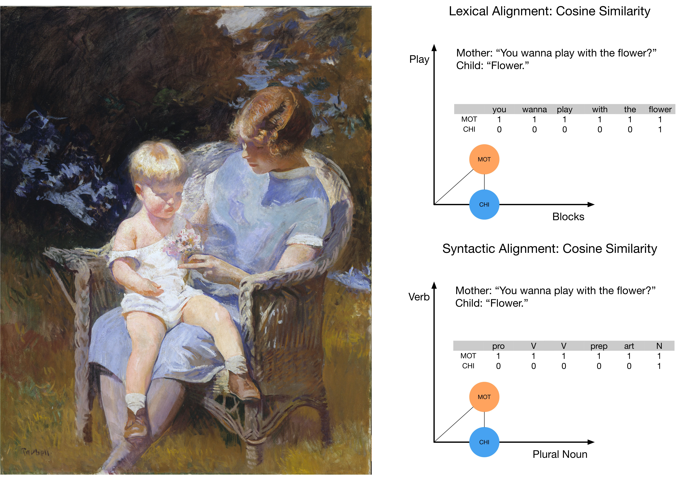

```{r setup, include=FALSE}
knitr::opts_chunk$set(echo = FALSE)
```

```{r libraries}
pacman::p_load("dplyr", "kableExtra", "tidyverse", "ggpubr")
```


```{r colorbar, echo=FALSE}
# for rendering pdf
#pagedown::chrome_print("/Users/ethan/Documents/GitHub/MOLA2020/Poster/standard/Fusaroli-et-al.Rmd")

# colorbar function copied from: https://stackoverflow.com/questions/49916591/how-to-reverse-only-one-bar-in-one-cell-if-the-value-is-negative-with-kableextra

# probably get rid of this, but leave it in for now, just in case I want to go back to tables with colorbars
cb <- function(x) {
  range <- max(abs(x))
  width <- round(abs(x / range * 50), 2)
  ifelse(
    x > 0,
    paste0(
      '<span style="display: inline-block; border-radius: 2px; ', 
      'padding-right: 2px; background-color: #FFD700; width: ', 
      width, '%; margin-left: 50%; text-align: right;">', x, '</span>'
    ),
    paste0(
      '<span style="display: inline-block; border-radius: 2px; ', 
      'padding-right: 2px; background-color: #F0F8FF; width: ', 
      width, '%; margin-right: 50%; text-align: right; float: right; ">', x, '</span>'
    )
  )
}


# function for making bar-plots out of table data

barcolor1 <- "#8FA2DF"
barcolor2 <- "#D8B743"

t1 <- read.csv("/Users/ethan/Documents/GitHub/MOLA2020/Poster/Table1b.csv")
t2 <- read.csv("/Users/ethan/Documents/GitHub/MOLA2020/Poster/Table2b.csv")
t3 <- read.csv("/Users/ethan/Documents/GitHub/MOLA2020/Poster/Table3b.csv")


bp <- function(t, title){
  t$Predictors <- factor(t$Predictors, levels = t$Predictors)
  t$Predictors <- fct_rev(t$Predictors)
  t <- gather(t, key = "Type", value = "LogOdds", -Predictors)

    ggplot(t, aes(t$Predictors, LogOdds)) +
    geom_bar(aes(fill = Type), position = "dodge", stat="identity") +
    coord_flip() +
    ylim(-0.75, 0.75) +
    scale_fill_manual("Alignment Type", values = c("Lexical" = barcolor1, "Syntactic" = barcolor2)) +
    theme_classic() +
    labs( y = "Beta (Log Odds)",
          x = "", 
          title = title)
}


 #   geom_errorbar(aes(ymin=len-sd, ymax=len+sd), width=.2,
  #             position=position_dodge(.9))

```


# What is Conversational Alignment, and How Can We Measure It?

```{r echo=FALSE, fig.cap = "Edmund C. Tarbell, \"Marjorie and Little Edmund\"",  out.width= "80%", fig.align="center"}

```

Conversational Alignment is the re-use of an interlocutor’s words and syntax, and helps establish common ground (REF). We calculated alignment as cosine similarity in turn-by-turn utterances in the conversations of 67 parent-child dyads over 2 years (approx. ages 2-4).

# What Predicts Whether Children Align With Parents' Utterances?  


```{r fig1, fig.cap = "Factors influencing liklihood of child aligning any tokens",message=FALSE, warning = F, out.width='75%'}

bp(t1, "")

#kable(t1, "html", align = "c", caption = "Alignment Rate: Do Children Align?", booktabs = T)

```

Older children align more often, although less in children with ASD. VS and MEL scores were the best predictors of children aligning their utterance.

# What Predicts Exact Repetition of Parents' Utterances?

```{r fig2, fig.cap = "Factors influencing liklihood of child aligning all tokens", message=FALSE, warning = F, out.width='75%'}


bp(t3, "")


```


# What Predicts the Amount of Alignment in Partialy Aligned Utterances?

```{r fig3, fig.cap = "Factors influencing amount partial alignment", message=FALSE, warning = F, out.width='75%'}

bp(t2, "")

```


# Next Steps


# Conclusion

# Technical details
We used Bayesian multilevel zero-and-one-inflated beta regression models to assess how much a variety of factors influence 1) whether children align at all with their parents' utterances, 2) how much they align, and 3) how much of their alignment is exact repetition. Alignment was calculated using the ALIGN Python library (Duran et al., 2019). We first contrasted child alignment in actual conversations with that in surrogate pairs formed by a parent and a child from two different dyads. We used Bayesian multilevel zero-and-one-inflated beta regression models. This accounts for the propensity of children to align at all (rate), the number of linguistic forms aligned on average when the children actually align (levelª), and exact repetitions, as a function of diagnostic group, visit, Vineland Socialization (VS), Mullen Expressive Language (MEL) and Visual Reception (MVR). 

```{r, include=FALSE}
knitr::write_bib(c('knitr','rmarkdown','posterdown','pagedown'), 'packages.bib')
```

# References
